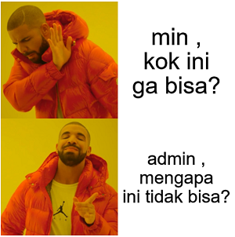
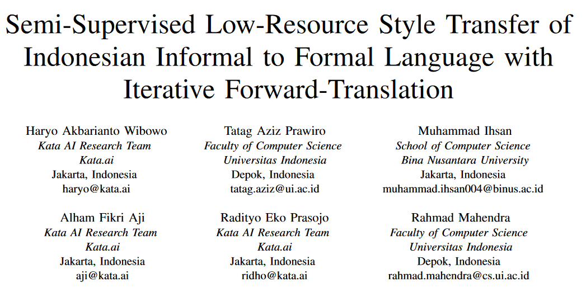

# STIF-Indonesia



An implementation of ["Semi-Supervised Low-Resource Style Transfer of Indonesian Informal to Formal Language with Iterative Forward-Translation"](https://arxiv.org/abs/2011.03286v1).

You can also find Indonesian informal-formal parallel corpus in this repository.

## Description

We were researching transforming a sentence from informal to its formal form. Our work addresses a style-transfer from informal to formal  Indonesian as a low-resource **machine translation**  problem. We benchmark several strategies to perform the style transfer.

In this repository, we provide the Phrase-Based Statistical Machine Translation, which has the highest result in our experiment. Note that, our data is extremely low-resource and domain-specific (Customer Service domain). Therefore, the system might not be robust towards out-of-domain input. Our future work includes exploring more robust style transfer. Stay tuned!

## Paper



You can access our paper below:

[Semi-Supervised Low-Resource Style Transfer of Indonesian Informal to Formal Language with Iterative Forward-Translation (IALP 2020)](https://arxiv.org/abs/2011.03286v1)

Medium Article: [Mengubah Bahasa Indonesia Informal Menjadi Baku Menggunakan Kecerdasan Buatan](https://medium.com/kata-engineering/mengubah-bahasa-indonesia-informal-menjadi-baku-menggunakan-kecerdasan-buatan-4c6317b00ea5) (In Indonesian)

## Requirements

We use the RELEASE 4.0 Ubuntu 17.04+ version which only works on the specified OS.

We haven't tested it on other OS (e.g.: OS X and Windows). If you want to run the source code, use Ubuntu 17.04+. If you use windows, we advise you to use the WSL-2 to run the code.

In this experiment, we wrap the MOSES code by using Python's `subprocess`. So Python installation is necessary. The system is tested on Python 3.9. We recommend it to install with `miniconda`. You can install it by following this link: https://docs.conda.io/en/latest/miniconda.html

## How To Run

First, clone the repository

```bash
git clone https://github.com/haryoa/stif-indonesia.git
```

Then run the MOSES downloader. We use .sh, so use a CLI application that can execute it. On the root project folder directory, do:

```bash
bash scripts/download_moses.sh
```

The script will download the Moses toolkit and extract it by itself.

### Run Supervised Experiments

To run the supervised one, do:

```bash
python -m stif_indonesia --exp-scenario supervised
```

It will read the experiment config in `experiment-config/00001_default_supervised_config.json`

### Run Semi-Supervised Experiments

To run the semi-supervised one, do:

```bash
python -m stif_indonesia --exp-scenario semi-supervised
```

It will read the experiment config in `experiment-config/00002_default_semi_supervised_config.json`

## Output

1. The training process will output the log of the experiment in `log.log`
2. The output of the model will be produced in the `output` folder

### Supervised output

It will output `evaluation`, `lm` , and `train`. `evaluation` is the result of  prediction on the test set, `lm` is the output of the trained LM, and `train` is the produced model by the Moses toolkit

### Semi-supervised output

It will output `agg_data`, `best_model_dir`, and `produced_tgt_data`. `agg_data` is the result of the forward-iteration data synthesis. `best_model_dir` is the best model produced by the training process, and `produced_tgt_data` is the prediction output of the test set.

### Score

Please check the `log.log` file which is the output of the process. 

## Additional Information

If you want to replicate the dictionary-based method, you can use any informal - formal or slang dictionary on the internet.

For example, you can use [this dictionary](https://github.com/louisowen6/NLP_bahasa_resources/blob/master/combined_slang_words.txt).

If you want to replicate our GPT-2 experiment, you can use a pre-trained Indonesian GPT-2 such as (this one](https://huggingface.co/cahya/gpt2-large-indonesian-522M), or train it by yourself by using [Oscar Corpus](https://oscar-corpus.com/). After that, you can finetune it with the dataset that we have provided here. You should follow the paper on how to transform the data when you do the finetuning.

We use [Huggingface](https://github.com/huggingface/transformers)'s off-the-shelf implementation to train the model.

## Team

1. Haryo Akbarianto Wibowo @ Kata.ai
2. Tatag Aziz Prawiro @ Universitas Indonesia
3. Muhammad Ihsan @ Bina Nusantara
4. Alham Fikri Aji @ Kata.ai
5. Radityo Eko Prasojo @ Kata.ai
6. Rahmad Mahendra @ Universitas Indonesia
